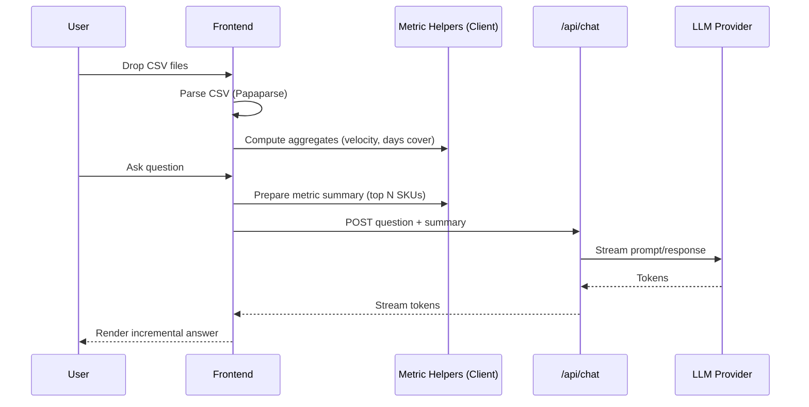

# Autonomous BI Agent – Detailed Design (React Chat Application)

## 1. Executive Summary
This document provides the low‑level design (LLD) for a **prototype** Autonomous Business Intelligence Agent: a React-based chat interface that lets apparel founders upload core commerce datasets (orders, products, inventory, marketing, returns) and ask analytical questions. For this prototype we explicitly **drop heavy validation, queueing, complex ingestion pipelines, external caches, and multi-service orchestration** in favor of a *single deployable Next.js application* (frontend + lightweight API routes) that can run on a free/low‑cost hosting tier (e.g., Vercel). Metrics are computed **on-demand in-browser or in simple API handlers** using parsed CSV data. Optional advanced components (vector search, provenance DB, background batch jobs) are out-of-scope for the demo but referenced where future extension is natural. The emphasis is: fast deploy, minimal infra, acceptable for non-sensitive sample data.

## 2. System Architecture
High-level prototype architecture layers (collapsed):

1. Presentation (React / Next.js Chat UI)
2. Lightweight Upload & Parse (client-first; fallback server route for raw file persistence if needed)
3. On-Demand Metrics & Aggregations (client memory; small helper functions)
4. Chat Orchestrator API Route (prompt assembly + LLM streaming)
5. Optional: Ephemeral In-Memory Provenance (simple object map) – may be skipped

Removed for prototype: Dedicated ingestion service, batch jobs, external metrics store, vector database. These can be reintroduced later.

### 2.1 Architecture Diagram
```mermaid
flowchart LR
  User((Founder)) --> UI[Next.js Chat UI]
  UI -->|Client Parse CSV| LocalMem[(Browser Memory/IndexedDB)]
  UI -->|Optional Upload| UP[/api/upload (store temp)/]
  UI -->|Ask Question| CHAT[/api/chat (LLM stream)/]
  LocalMem --> CHAT
  CHAT --> LLM[LLM API]
  LLM --> CHAT --> UI
```

### 2.2 Key Flows
- Dataset Upload: UI parses CSV client-side (Papaparse); retains arrays in memory (and optionally IndexedDB for session persistence). Optional server upload only for sharing across tabs (ephemeral).
- Question Answering: UI derives simple aggregates (velocity, days cover, return rate, roas) on demand → sends top-N structured metric summary + user question to `/api/chat` → API route assembles prompt → calls LLM streaming endpoint → emits tokens.
- Proactive Insights: Generated lazily on first question or when user clicks a "Generate Insights" button (no background scheduler in prototype).

### 2.3 Technology Choices (Assumptions)
- Frontend: Next.js (App Router) + TypeScript + Tailwind (or minimal CSS) + React Query (optional) + SSE (native EventSource) or fetch streaming.
- Backend: Next.js API routes only (no separate service layer) for `/api/chat` (LLM streaming) and optional `/api/upload`.
- Storage: None persistent required. Primary: Browser memory + optional IndexedDB; ephemeral server `/tmp` for uploaded files (lost on cold start). Optional free tier (Supabase / Firebase) can be plugged later for persistence.
- Caching: In-memory JS objects (per request lifecycle) only; no Redis.
- Vector Store: Omitted. Simple keyword filter & metric ranking forms context.
- LLM Access: Hosted API (OpenAI or provider) via single edge/serverless route; streaming tokens forwarded.

## 3. Component Design

### 3.1 Frontend Components
| Component | Responsibility | Key Props/State | Notes |
|-----------|----------------|-----------------|-------|
| `AppShell` | Layout, theme, auth gating | `user`, `org` | Renders dataset + chat panels |
| `ChatPanel` | Orchestrates conversation | `messages`, `onSend` | Subscribes to SSE stream |
| `MessageList` | Virtualized message rendering | `messages` | Handles autoscroll & anchoring |
| `MessageBubble` | Variant rendering | `message` | Delegates structured cards |
| `MessageInput` | Compose & send | `onSubmit`, `suggestions` | Slash command parsing |
| `FileUploadDrawer` | Bulk dataset upload | `files`, `statuses` | Drag/drop + progress |
| `DatasetStatusPanel` | Show ingestion health | `datasets` | Highlights blockers |
| `InsightCard` | Structured analytics | `insight` | KPI tags, expand raw data |
| `ProvenanceModal` | Data lineage display | `answerId` | Fetch provenance JSON |
| `LoadingIndicator` | Streaming / job progress | `phase` | Inline or overlay |
| `ErrorBoundary` | Catch render errors | N/A | Reports telemetry |

State Handling:
- Conversation state normalized: `messages: Record<id, Message>` + ordered id list for performance.
- React Query keys: `['datasets']`, `['insights','latest']`, `['provenance', answerId]`.
- SSE subscription merges incremental assistant tokens into a draft message object before final commit.

### 3.2 Backend Logical Pieces (Prototype)
| Piece | Responsibility | Implementation |
|-------|----------------|----------------|
| `/api/chat` | Accept question + metric summary; stream LLM response | Single Next.js API route (Edge runtime if possible) |
| `/api/upload` (optional) | Temporary raw file store (if server parsing desired) | Writes to `/tmp`; returns file id |
| Metrics Helpers | Compute aggregates (velocity, returns, roas) | Pure TS functions in shared lib |
| Prompt Builder | Format system + user prompt with metric lines | Utility function |
| Streaming Adapter | Convert provider stream → SSE/Fetch stream | Node/Edge readable stream transform |
| (Optional) Provenance Map | Keep last N answers with metric snapshot | In-memory Map, non-persistent |

### 3.3 Sequence – Upload (Client Parse) → First Answer


## 4. Data Design

### 4.1 Raw Input (Prototype Handling)
CSV files parsed directly in browser; retained as arrays of objects. Canonical column expectations (no strict validation, just soft matches):
- orders: `order_id, customer_id, sku, quantity, price, order_date`
- products: `sku, product_name, category, size, color, cost_price, selling_price`
- inventory (optional): `sku, date, stock_level`
- marketing (optional): `campaign_id, channel, spend, conversions, date`
- returns (optional): `return_id, order_id, sku, return_reason, return_date`
If a column is missing the feature that depends on it is simply skipped.

### 4.2 In-Memory Derived Structures
| Structure | Purpose | Notes |
|----------|---------|-------|
| `productsIndex` | Map sku → product row | Created after products parse |
| `ordersBySku` | sku → array/order rows | Built once; reused for aggregates |
| `metricsCache` | sku → {velocity14, revenue14, units14, returns14, daysCover} | Recomputed on file change |
| `questionHistory` | Array of prior Q/A objects | Local only (optionally localStorage) |
| `insights` | Precomputed top winners / risks | Generated lazily |

### 4.3 Derived Metrics (Examples)
- `sales_velocity_14d = sum(units over last 14 days) / 14`
- `days_cover = stock_level / (sales_velocity_14d + epsilon)`
- `winner_score = w1*growth_pct + w2*velocity_rank_delta + w3*margin_rank` (weights configurable)
- `return_rate = units_returned / units_sold_window`
- `roas = attributed_revenue / spend`

### 4.4 Vector Index Entries
| Field | Description |
|-------|-------------|
| `id` | UUID for embedding row |
| `type` | `sku_description` | 
| `text` | Normalized text (product name + attributes) |
| `embedding` | Float vector |
| `metadata` | JSON (sku, category, tags) |

### 4.5 Data Persistence Notes
No server database in prototype. Everything ephemeral. Optional future persistence (Supabase/Postgres) can materialize tables similar to the earlier full design.

## 5. API Specifications (v1)
Base path: `/api` (prototype, flat)

### 5.1 Authentication
Simple bearer token (per org) for v1. Future: magic link + short-lived session token.

### 5.2 Endpoints (Prototype Minimal)
| Method | Path | Purpose | Request | Response | Notes |
|--------|------|---------|---------|----------|-------|
| POST | `/chat` | Ask question w/ metric summary | `{question, metricsSummary, options?}` | Stream (text tokens) then final JSON | Accepts simplified metricsSummary array |
| POST | `/upload` (optional) | Store raw file temporarily | `multipart/form-data {file, type}` | `{filename, size}` | Only if server parsing needed |
| GET | `/health` | Liveness check | - | `{status:'ok'}` | Useful for monitoring |

Removed: schema mapping, dataset status, provenance, drill-down (can be reinstated later).

### 5.3 Streaming Protocol (Simplified)
Single fetch stream or EventSource producing plain text chunks. Optional JSON sentinel at end:
- Chunks: raw UTF-8 text appended to current assistant draft.
- Terminator: line starting with `@@END@@` followed by a JSON object `{"suggestedFollowUps":[...],"rawAnswer":"..."}`.
This avoids managing multiple SSE event types.

### 5.4 Error Codes (Prototype)
`LLM_ERROR`, `INPUT_TOO_LARGE`, `UNSUPPORTED_OPERATION`.

## 6. Security Design
- Isolation: All data keyed by `org_id`; no cross-org retrieval queries permitted.
- Principle of Least Privilege: Upload endpoints restricted to write scope token; question endpoints read scope.
- Basic Input Handling: No deep schema validation; limit file size and row count client-side.
- Secrets Management: LLM API key stored as environment variable in hosting platform.
- No persistent auditing (prototype); potential simple console logs for debugging.
- Data Minimization: Encourage sample / synthetic data only; no PII.
- Light Guardrails: Cap question length; block obviously harmful prompt patterns (simple regex list).

## 7. Performance Considerations
- Target Time-To-First-Token < 2s (network + provider latency dominated).
- On-demand metric computation (simple JS) for each question; caching optional (memoization within session).
- No server cache / Redis.
- No vector retrieval; rely on top-N metric ranking heuristics.
- Horizontal scaling not required; single serverless deployment handles low demo traffic.

## 8. Implementation Plan
| Phase | Scope | Deliverables | Exit Criteria |
|-------|-------|-------------|---------------|
| 0 | Scaffold | Next.js app, chat UI shell, env var for LLM key | Deployed placeholder page |
| 1 | CSV Parse & State | Client parsing + storage + sample data loader | User sees parsed SKU counts |
| 2 | Metrics Helpers | Velocity, days cover, returns, roas functions | Metrics summary panel renders |
| 3 | Chat Integration | `/api/chat` streaming + prompt builder | User gets streamed answers referencing metrics |
| 4 | Insight Generation | Top winners/risks function + rendered cards | One-click insights appear |
| 5 | Polish & Deploy | Styling, disclaimers, sample CSV download | Public demo link shareable |

## 9. Risk Assessment
| Risk | Impact | Likelihood | Mitigation |
|------|--------|------------|-----------|
| Large files freeze browser | Poor UX | Medium | Enforce size/row caps, chunk parse |
| LLM hallucination | Misleading answer | Medium | Include explicit metric lines; add disclaimer banner |
| Provider outage | No answers | Low | Show fallback error + retry button |
| Cost overrun (LLM) | Exceeds free tier | Low | Limit max tokens & daily questions |
| Data loss on reload | User confusion | Medium | Provide re-upload reminder & sample loader |

## 10. Appendices

### 10.1 Chat Message Schema (Prototype Simplified)
```ts
type UserMessage = { id:string; role:'user'; text:string; ts:number };
type AssistantMessage = { id:string; role:'assistant'; text:string; ts:number; insights?:InsightCard[] };
type SystemMessage = { id:string; role:'system'; text:string; level:'info'|'warning'|'error'; ts:number };
type ChatMessage = UserMessage | AssistantMessage | SystemMessage;
```

### 10.2 Insight Payload Examples
Winner summary, inventory risk, returns anomaly payload patterns reuse `type` discriminator + standardized metric arrays.

### 10.3 Assumptions & Open Questions (Prototype)
- Layout: two-pane (chat + data summary) per `View.png` assumption.
- LLM provider: OpenAI (gpt-4o-mini or similar cheaper tier) or OpenRouter alt; must support streaming.
- Attribution: naive date co-occurrence; acceptable for demo.

### 10.4 Future Enhancements (Beyond v1)
- Advanced seasonal forecasting integration.
- Image embedding similarity for style clustering.
- Automated reorder drafts with approval workflow.
- Slack / Email push of daily insight digest.

### 10.5 Glossary
| Term | Definition |
|------|------------|
| Winner SKU | SKU with high velocity growth & margin contribution exceeding threshold |
| Days Cover | Days until stockout at current velocity |
| RAG | Retrieval-Augmented Generation (LLM pattern with contextual grounding) |
| Provenance | Verifiable mapping from answer to exact data inputs |

---
End of Detailed Design Document.

## 11. Prototype Simplification & Deployment Notes (THIS BUILD)
The current iteration is a demonstration prototype prioritizing speed-to-demo over robustness.

### 11.1 What We Are NOT Doing in Prototype
- No deep schema validation beyond basic header presence.
- No asynchronous ingestion job queue; files processed immediately on upload.
- No Redis / external cache; in-memory Node maps (auto-reset on redeploy).
- No background daily batch; proactive insights generated on-demand when user asks or on first load (cached in memory per session).
- No multi-org isolation (single demo org context).
- No auth (public demo link) – caution: only use sample / non-sensitive data.
- No robust rate limiting; minimal per-request guard (e.g., max 1 active LLM generation per session).
- No vector database; simple in-memory embedding list using lightweight embedding API (or stubbed retrieval with keyword match).

### 11.2 Minimal Data Flow (Prototype)
1. User uploads CSVs → Browser parses & sends normalized JSON slices (optional) OR raw file to backend.
2. Backend stores original file in ephemeral storage directory and loads into an in-memory DuckDB instance (or SQLite / DuckDB file on disk if allowed by hosting platform).
3. When user asks a question, metrics computed on-the-fly with simple SQL aggregations (14d velocity, return rate, ROAS).
4. Context (top N SKUs metrics) embedded (optional) and sent with prompt to LLM API.
5. Response streamed back via SSE.

### 11.3 Chosen Simplified Stack
- Frontend Hosting: Vercel (Next.js App Router) or Netlify. (Next.js recommended for built-in API routes + easy deployment link.)
- Backend: Next.js API routes (single deployment) – avoids separate server management.
- Storage: In-memory plus temporary `/tmp` file storage (Vercel ephemeral) for uploaded CSV; re-upload required after cold start.
- Analytical Engine: DuckDB WASM client-side OR DuckDB node binding (may not persist across cold starts). For maximum reliability in serverless, fallback to client-side parsing (Papaparse + custom aggregations). Decision: start with client-side parsing to reduce server complexity.
- LLM: Hosted API (e.g., OpenAI) behind single serverless route; streaming via edge function.

### 11.4 Prototype Data Limits
- Max file size per dataset: 5 MB.
- Max rows processed per file: 25k (rows beyond ignored with a warning message bubble).
- Supported required datasets: `orders.csv`, `products.csv` (inventory, marketing, returns optional for demo scenarios).

### 11.5 Simplified Metrics (Inline Formulas)
- Velocity (14d): Filter rows where `order_date >= today - 14`; sum quantity per SKU.
- Return Rate: If returns file present, `returned_units / sold_units_14d`.
- ROAS: If marketing file present, `sum(revenue_attributed) / sum(spend)` (simple SKU or campaign join by date using basic matching).
- Days Cover: If inventory file present, `stock_level / (velocity_14d / 14)`.

### 11.6 Prompt Strategy (Reduced)
Single system prompt template injecting top K SKU metric lines; no JSON schema enforcement – rely on a post-hoc regex to extract SKU references; show disclaimer that results are approximate.

### 11.7 Risks (Prototype-Specific)
- Public demo without auth may be misused → show banner "Demo only – do not upload proprietary data".
- Ephemeral memory means data loss on redeploy → instruct user to re-upload if session resets.
- Lack of validation may produce misleading metrics → label all insights as "Preview".

### 11.8 Upgrade Path to Production
| Prototype Element | Production Upgrade |
|-------------------|--------------------|
| Client-side parsing | Server ingestion + validation service |
| In-memory metrics | Materialized metric tables / cache |
| Single org | Multi-tenant auth & isolation |
| No provenance storage | Append-only provenance DB |
| Simple prompt | Guardrailed structured output + schema validator |
| No rate limiting | Org & IP based quotas + abuse detection |

### 11.9 Deployment Steps (High-Level, Refined)
1. Create Next.js app (`npx create-next-app@latest`) – select TypeScript & Tailwind.
2. Add `/app/page.tsx` with chat layout + file drop zone.
3. Add Papaparse (`npm i papaparse`) and implement client parse hook.
4. Implement metrics helper module.
5. Add `/pages/api/chat.ts` (or `/app/api/chat/route.ts`) streaming route; environment var `LLM_API_KEY`.
6. Local test with sample CSV; verify streaming works.
7. Deploy to Vercel (`vercel deploy`); set env var; open public URL.
8. Add banner + sample dataset download links + disclaimers.

### 11.10 Public Demo Constraints
- Encourage sample dataset download link (provide curated small CSVs).
- Clear instructions: drag at least `orders.csv` + `products.csv` then ask: "List potential winners this week".

---
