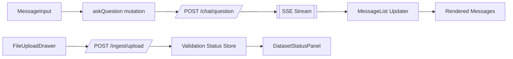
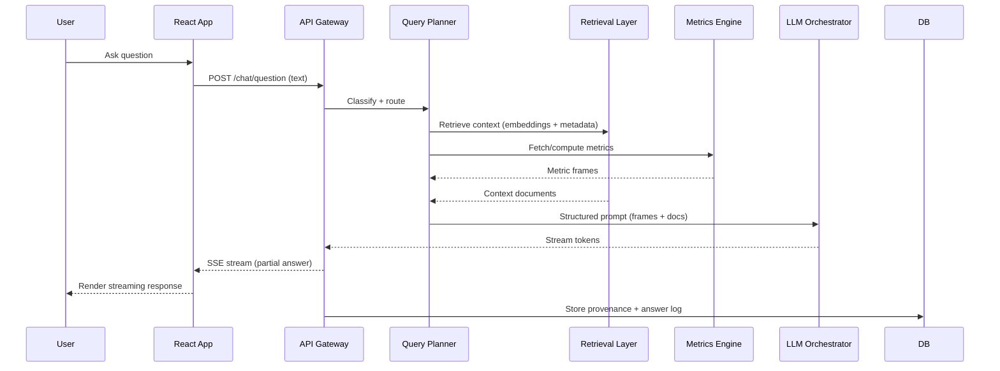

# Prototype Specification (Markdown Version)

## 1. Hypothesis & Strategic Fit (Shortened)
We are building an **autonomous business intelligence agent** for apparel startups like Wynch. The agent addresses founder challenges such as identifying winning products, reducing wasted ad spend, managing stockouts/overstock, and cutting losses from returns. Its strategic fit is enabling **profitable growth without scaling operations**, by surfacing real-time insights and proactive recommendations.

---

## 2. Users, JTBD & Outcomes

**Persona:** Apparel founder/operator, lean team, overwhelmed by data.

**Jobs To Be Done (JTBD):**
1. Highlight emerging winners/losers by SKU to guide design and promotions.
2. Forecast inventory to avoid stockouts and over-ordering.
3. Derive ROAS from ads + sales data to reallocate spend effectively.
4. Surface return patterns tied to SKUs to improve sizing and reduce margin loss.

**Top Outcomes (v1):**
- 20% fewer stockouts/overstocks.
- +15% improvement in ROAS.
- Weekly detection of 3 winners and 3 losers.
- Identify top 2 high-return SKUs with insights.

---

## 3. Scope (In / Out)

**In-scope v1:**
- Automated detection of winners/losers by SKU.
- Inventory risk forecasting with reorder suggestions.
- Ads performance analysis tied to inventory.
- Returns analysis surfacing top issues.

**Non-goals (Phase II+):**
- Full seasonal demand forecasting.
- Creative generation for ads/design.
- End-to-end supply chain automation.
- Real-time dynamic pricing.

**Assumptions:**
- Minimum 50+ transactions/month.
- Sales, inventory, and marketing data digitized (CSV/API).

**Trade-offs:**
- Prioritize speed of insights over perfect accuracy.
- Human-in-loop for irreversible or ambiguous actions.

---

## 4. Data & Grounding

**Sources:**
- Orders/transactions.
- Product catalog (SKU-level attributes).
- Inventory snapshots and lead times.
- Marketing & ad spend (ROAS derived from spend + sales).
- Returns data (reason codes linked to SKUs).
- Optional enrichments: holidays, weather, social buzz.

**Grounding Rules:**
- Ignore SKUs with <10 sales.
- Inventory risk = stock level vs trailing 14-day sales velocity.
- Ads flagged only if spend high AND sales lift absent (≥20 sales).
- Returns flagged if >15% return rate.
- Cross-validate across multiple sources before recommending.
- Provide audit log citing exact data used.

**Freshness:** Daily refresh (orders, inventory, ads, returns). Optional near-real-time ads via API.

---

## 4a. Input Format

**Required Datasets (CSV examples):**
- `orders.csv`: order_id, customer_id, sku, quantity, price, order_date.
- `products.csv`: sku, product_name, category, size, color, cost_price, selling_price.
- `inventory_daily.csv`: sku, date, stock_level, reorder_lead_time.
- `marketing_daily.csv`: campaign_id, channel, spend, impressions, clicks, conversions, date.
- `returns.csv`: return_id, order_id, sku, return_reason, return_date.

**Optional Enrichment Files:**
- `calendar.csv`: date, holiday/event.
- `weather_by_city.csv`: date, city, weather_metric.

**Notes:**
- All datasets keyed at SKU level where applicable.
- No customer PII beyond anonymized customer_id required.
- Files ingested daily for analysis and grounding.

---

## 5. Application Architecture & Flow (React Chat App)

### 5.1 High-Level Concept
Single-page React application with a **chat-first analyst assistant** that: (a) ingests CSV datasets, (b) validates & indexes them, (c) answers natural language questions using retrieval + analytical pipelines, and (d) proactively surfaces SKU-level insights (winners/losers, inventory risks, ad inefficiencies, returns issues). The user never leaves the chat surface; structured insights arrive as rich message types.

### 5.2 Primary User Journey (v1)
1. User lands on app (no data yet) → prompted to upload required datasets.
2. User drags/drops `orders.csv`, `products.csv`, etc. (any order) into the upload drawer.
3. Each file is validated (schema + semantic checks) → status chips update (Missing / Processing / Valid / Error).
4. After minimum viable set present (`orders`, `products`, `inventory_daily`), background profiling & indexing runs.
5. System posts a "Data Ready" message with a summary + suggested starter questions.
6. User asks: "Which SKUs are emerging winners this week?".
7. Backend orchestrates: semantic parse → determine intent (Winners Query) → pull computed metrics (velocity, margin, ROAS joins) → generate insight frames → retrieval-augmented LLM response.
8. Chat shows: (a) concise natural language answer, (b) expandable structured insight cards, (c) data provenance link.
9. User can request follow-ups ("Show inventory risk for those winners"), chaining context.
10. Daily at refresh, new proactive insights appear pinned at top.

### 5.3 Frontend (React) Architecture
Core principles: minimal global state, streaming UX, optimistic interaction, clear provenance.

Components (proposed):
- `AppShell` – Layout, theme, auth gating.
- `ChatPanel` – Main conversation container.
- `MessageList` – Virtualized scroll of message objects.
- `MessageBubble` – Renders each message variant (text, insight, status, error).
- `MessageInput` – Text box + slash commands + attachment triggers.
- `FileUploadDrawer` – Drag/drop zone, per-file status, schema diff preview.
- `DatasetStatusPanel` – Summarizes ingestion health (Required / Optional / Errors).
- `InsightCard` – Structured metrics (tables, KPI deltas, tags like WINNER / RISK).
- `LoadingIndicator` – Streaming token or analytical job progress.
- `ErrorBoundary` – Catches render/runtime issues.
- `ProvenanceModal` – Shows raw rows, filters, formulas used.

State & Data Layer:
- Local UI state: component-level (controlled inputs, dialog open flags).
- Global ephemeral session: `conversation`, `uploadedDatasets`, `activeUploadJobs`.
- Server synchronization: React Query (queries: `datasets`, `insights/latest`, `chat/history` ; mutations: `uploadFile`, `askQuestion`).
- Streaming answers: Server-Sent Events (SSE) or WebSocket for incremental tokens + progress events.

Mermaid (logical client data flow):


### 5.4 Backend Service Layer (Conceptual)
- API Gateway / BFF: Normalizes client requests, attaches auth, emits SSE for streaming.
- Ingestion Service: Handles file upload, type inference, schema validation, column mapping (e.g., attempts to map `price` vs `selling_price`).
- Data Storage:
	- Raw Zone: Original CSVs (versioned).
	- Processed Zone: Parquet/columnar standardized tables.
	- Metrics Store: Daily fact tables (sku_day_sales, sku_inventory_velocity, sku_return_stats).
	- Vector Store: Embeddings for SKU descriptions, insight summaries, prior Q&A.
- Transformation / Metrics Engine: Batch + micro-batch jobs computing:
	- Trailing sales velocity (7d / 14d / 28d)
	- Winner / loser scoring (growth rate, margin contribution, velocity rank shifts)
	- Inventory risk days-cover calculation
	- Return rate & dominant reasons per SKU
	- Ad spend efficiency joins (spend vs attributed sales)
- Query Planner: Interprets user intent -> selects metric frames -> assembles structured context.
- Retrieval Layer: Hybrid search (keyword + embedding) across metrics, prior answers, product catalog.
- LLM Orchestrator: RAG pipeline (Prompt Template -> Inject Context -> Constrain Output Schema -> Stream Tokens).
- Audit & Provenance: Stores `answer_id` → underlying dataset snapshot + filters + metrics used.
- Auth & Quotas: Rate limits question frequency; blocks incomplete ingestion workflows.

### 5.5 Dataset Upload & Validation Flow
Steps per file:
1. Upload received (multipart) → temp storage.
2. Signature hash computed (dedupe / version).
3. Schema inference (header parsing, dtype sampling, row count, null profile).
4. Semantic mapping (e.g., `order_date` vs `date_ordered`).
5. Rule validation (required columns present, row count > minimum, date coverage recent).
6. Quality scoring (null density, numeric outliers, duplicate SKUs).
7. Persist raw; enqueue transformation job.
8. On success: emit `dataset.updated` event; on failure: structured error message to chat.

Validation Rules (illustrative):
- `orders.csv`: columns {order_id, sku, quantity, price, order_date}; >= 50 rows; 90%+ of last 30 days present.
- `products.csv`: non-null `sku`, `selling_price > 0`.
- `inventory_daily.csv`: `stock_level >= 0`; no gaps > 2 days in last 14.
- `returns.csv`: `return_reason` in controlled vocabulary if provided.
- Cross-file: Every `orders.sku` must appear in `products.sku` (else warn), mismatched SKUs summarized.

### 5.6 Question Answering Lifecycle
1. Receive user text.
2. Pre-parse: detect slash commands (`/schema`, `/metrics`) OR natural language.
3. Intent classification (Analytics vs Exploratory vs Follow-up vs Data Issue).
4. Entity extraction: SKUs, date ranges, metric types (velocity, margin, return rate).
5. Retrieval: Fetch top-k metric frames + related historical insight cards + product metadata.
6. Gap check: If required dataset missing -> return blocking status message.
7. Analytical assembly: Compute incremental metrics if window differs (e.g., "last 10 days").
8. Prompt construction (system + guardrails + structured context JSON).
9. LLM streaming generation with schema constraints (e.g., JSON blocks separated from narrative).
10. Post-processing: Validate JSON, attach provenance IDs, store in conversation log.
11. Emit final message + suggested follow-ups.

Sequence (Mermaid):


### 5.7 Chat Message Types (Canonical Structures)
Represented internally as discriminated union (pseudo-TS):
```ts
type ChatMessage =
	| { id: string; role: 'user'; text: string; ts: string }
	| { id: string; role: 'assistant'; kind: 'answer'; text: string; insights?: InsightCardRef[]; provenanceId: string; ts: string }
	| { id: string; role: 'system'; kind: 'status'; status: 'ingesting'|'validating'|'computing'; detail?: string; ts: string }
	| { id: string; role: 'system'; kind: 'error'; code: string; message: string; retryable: boolean; ts: string }
	| { id: string; role: 'assistant'; kind: 'insight'; insight: InsightPayload; ts: string }
	| { id: string; role: 'assistant'; kind: 'followups'; suggestions: string[]; ts: string };
```

Example `InsightPayload` (winner detection):
```json
{
	"type": "winner_summary",
	"window": "2025-09-09 to 2025-09-23",
	"criteria": {"min_sales": 10, "growth_window_days": 14},
	"skus": [
		{"sku": "TSHIRT-BLK-S", "sales_14d": 128, "growth_pct": 42.5, "return_rate": 4.1, "days_cover": 7},
		{"sku": "HOODIE-GRY-M", "sales_14d": 64, "growth_pct": 35.0, "return_rate": 6.2, "days_cover": 5}
	],
	"provenance_id": "ans_84723"
}
```

### 5.8 Error Handling & Resilience
- Frontend retries (exponential) for transient network (HTTP 5xx, 429 with `Retry-After`).
- Partial ingestion tolerated: non-blocking features degrade gracefully; blocked queries return actionable system status.
- Guardrails: refuse answers if metric frames empty when intent requires them (prevent hallucination).
- Structured error codes: `INGEST_SCHEMA_MISMATCH`, `MISSING_DATASET`, `ANALYTICS_TIMEOUT`, `LLM_CONTENT_FILTER`.

### 5.9 Performance & Caching
- Hot metric frames cached (Redis / in-memory) keyed by (sku, window, metric_set).
- Vector retrieval pre-warmed after daily batch.
- Streaming tokens start < 1.5s p95 after user submit.
- Upload parallelism limited (e.g., 3 concurrent) to preserve CPU for transformations.

### 5.10 Security & Compliance (v1)
- Row-level PII excluded by design (only anonymized IDs).
- Signed upload URLs, short-lived (5 min).
- Auth: email + magic link or SSO (future). Each org logical namespace.
- Data isolation: org_id partition in storage + metric tables.
- Audit logs immutable (append-only) for each answer.

### 5.11 Observability
- Structured event stream: `upload.started`, `upload.validated`, `job.metrics.completed`, `qa.answered`, `qa.blocked`.
- Metrics: time-to-first-token, ingestion latency per file, answer assembly latency breakdown.
- Central trace (OpenTelemetry) across ingestion → query planner → LLM call.

### 5.12 Extensibility Roadmap
Near-term (v1.x):
- Add `/schema` command to dump inferred columns.
- Add inline drill-down (click SKU → mini timeseries sparkline modal).
- Support incremental CSV append (delta ingestion instead of full reload).

Mid-term (v2):
- Multi-modal SKU enrichment (image embeddings for style clustering).
- Cost optimization recommendations (bundle positioning, discount impact analysis).
- Webhook triggers (Slack summaries each morning).

Long-term:
- Auto-generated experiments (“Test price elasticity for top 3 winners”).
- Autonomous reorder initiation (with manual approval gate).

### 5.13 Success Criteria (Architecture Perspective)
- < 10 min from fresh workspace to first valid answer using sample data.
- p95 ingestion (5 core files, 50k rows each) < 3 min.
- p95 answer end-to-end latency (non-streaming) < 8s; time-to-first-token < 1.5s.
- 0 hallucinated SKUs in benchmark test set (guardrail enforced).
- 100% of answers have provenance link resolving to underlying metric frames.

---

End of extended architecture specification.
